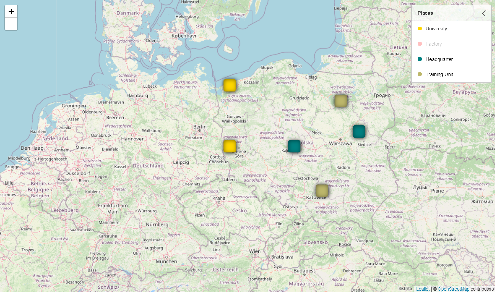

# leaflet-place-groups-picker

Plugin for the Leaflet maps that allows grouping places in groups whose visibility can be toggled.

## Installation

```
npm i -P leaflet-place-groups-picker
```

## How to use the plugin



```
const map = L.map('map',{
  center: [52, 16],
  zoom: 6
});

L.tileLayer('https://{s}.tile.openstreetmap.org/{z}/{x}/{y}.png', {
  attribution: '&copy; <a href="https://www.openstreetmap.org/copyright">OpenStreetMap</a> contributors'
}).addTo(map);

/* add control to a map */

const grouping = L.control.placeGroupsPicker({
  position: 'topright',
  caption: 'Places'
});

map.addControl(grouping);

/* add groups */

grouping.addGroup('Malls', { map, color: 'gold' });
grouping.addGroup('Schools', { map, color: 'red' });

/* add places to groups */

grouping.addPoint('Malls', [50, 15]);
grouping.addPoint('Malls', [54, 15]);

grouping.addPoint('Schools', [50, 17]);
grouping.addPoint('Schools', [54, 17]);
```

### Options

| Option | Description | Default value |
|----|----|----|
| `position` | Where to place a control on the map (`topleft`, `topright`, `bottomleft` or `bottomright`). | no default value |
| `caption` | Caption to display in a control. | `Groups` |
| `iconSize` | Size of icons. | `[30, 30]` |
| `iconShadow` | Whether to add a shadow to icons. | `false` |
| `iconInnerShadow` | Whether to add an inset shadow to icons. | `false` |
| `iconStyle` | Icon style: `rectangle`, `circle` or `rounded` | `rectangle` |

### `addGroup(name, options)`

Adds new group of places.

* `name` - name of a group
* `options`- options of a group:
  * `map` - a map reference
  * `color` - color of icons related to the group

### `addPoint(group, coords)`

Adds new point to a group.

* `group` - name of a group the point belongs to
* `coords` - coordinates of the point, passed as the `[lat, lng]` array